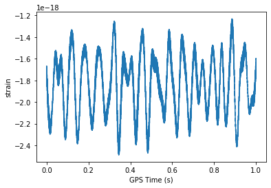

### HDF5 files
The most efficient way to store large files up to the exabyte scale.


```python
import h5py
filenmae = 'L-L1_LOSC_4_V1-1126259446-32.hdf5'
data = h5py.File(filenmae, 'r')
print(type(data))
```

    <class 'h5py._hl.files.File'>


```python
for key in data.keys():
    print(key)
```

    meta
    quality
    strain


```python
for key in data['meta'].keys():
    print(key)
```

    Description
    DescriptionURL
    Detector
    Duration
    GPSstart
    Observatory
    Type
    UTCstart


```python
print(data['meta']['Description'][()],data['meta']['Detector'][()])
```

    b'Strain data time series from LIGO' b'L1'


```python
import numpy as np
# Get the HDF5 group: group
group = data['strain']

# Check out keys of group
for key in group.keys():
    print(key)

# Set variable equal to time series data: strain
strain = data['strain']['Strain'][()]

# Set number of time points to sample: num_samples
num_samples = 10000

# Set time vector
time = np.arange(0, 1, 1/num_samples)

# Plot data
plt.plot(time, strain[:num_samples])
plt.xlabel('GPS Time (s)')
plt.ylabel('strain')
plt.show()

```

    Strain





```python

```
