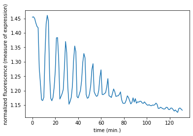

### MATLAB
for "Matrix Laboratory"     
'.mat' files


```python
# Import package
import scipy.io

# Load MATLAB file: mat
mat = scipy.io.loadmat('ja_data2.mat')

# Print the datatype type of mat
print(type(mat))

```

    <class 'dict'>


```python
import matplotlib.pyplot as plt
import numpy as np
# Print the keys of the MATLAB dictionary
print(mat.keys())

# Print the type of the value corresponding to the key 'CYratioCyt'
print(mat['CYratioCyt'])

# Print the shape of the value corresponding to the key 'CYratioCyt'
print(np.shape(mat['CYratioCyt']))

# Subset the array and plot it
data = mat['CYratioCyt'][25, 5:]
fig = plt.figure()
plt.plot(data)
plt.xlabel('time (min.)')
plt.ylabel('normalized fluorescence (measure of expression)')
plt.show()

```

    dict_keys(['__header__', '__version__', '__globals__', 'rfpCyt', 'rfpNuc', 'cfpNuc', 'cfpCyt', 'yfpNuc', 'yfpCyt', 'CYratioCyt'])
    [[0.         1.53071547 1.54297013 ... 1.34990123 1.35329984 1.34922173]
     [0.         1.28605578 1.29385656 ... 1.31307311 1.30039694 1.30563938]
     [0.         1.32731222 1.32884617 ... 1.24887565 1.24506205 1.25825831]
     ...
     [0.         0.         0.         ... 0.         0.         0.        ]
     [0.         1.44552606 1.42862357 ... 0.         0.         0.        ]
     [0.         1.45794466 0.         ... 1.1229479  1.12224652 1.1486481 ]]
    (200, 137)





```python

```
