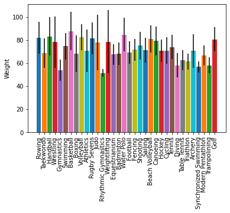

```python
import matplotlib.pyplot as plt
import pandas as pd

summer_2016_medals = pd.read_csv('summer2016.csv', index_col=0)
```

### Unique values of a column


```python
# Extract the "Sport" column
sports_column = summer_2016_medals['Sport']

# Find the unique values of the "Sport" column
sports = sports_column.unique()

# Print out the unique sports values
print(sports)
```

    ['Rowing' 'Taekwondo' 'Handball' 'Wrestling' 'Gymnastics' 'Swimming'
     'Basketball' 'Boxing' 'Volleyball' 'Athletics' 'Rugby Sevens' 'Judo'
     'Rhythmic Gymnastics' 'Weightlifting' 'Equestrianism' 'Badminton'
     'Water Polo' 'Football' 'Fencing' 'Shooting' 'Sailing' 'Beach Volleyball'
     'Canoeing' 'Hockey' 'Cycling' 'Tennis' 'Diving' 'Table Tennis'
     'Triathlon' 'Archery' 'Synchronized Swimming' 'Modern Pentathlon'
     'Trampolining' 'Golf']


### Automate plotting


```python
fig, ax = plt.subplots()

# Loop over the different sports branches
for sport in sports:
  # Extract the rows only for this sport
  sport_df = summer_2016_medals[summer_2016_medals['Sport'] == sport]
  # Add a bar for the "Weight" mean with std y error bar
  ax.bar(sport, sport_df['Weight'].mean(), yerr=sport_df['Weight'].std())

ax.set_ylabel("Weight")
ax.set_xticklabels(sports, rotation=90)

# Save the figure to file
fig.savefig('sports_weights.png')
```




