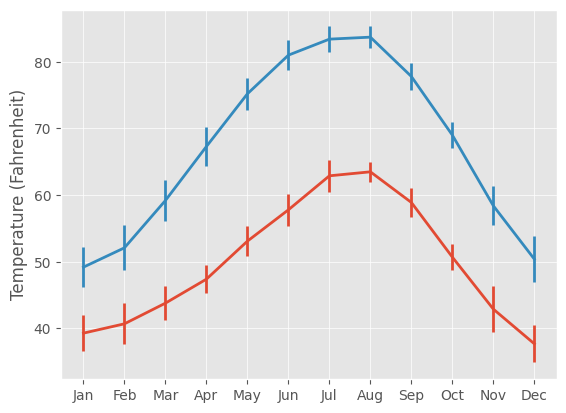

```python
import matplotlib.pyplot as plt
import pandas as pd

seattle_weather = pd.read_csv('seattle_weather.csv').loc[:11]
austin_weather = pd.read_csv('austin_weather.csv')
seattle_weather['MONTH'] = pd.to_datetime(seattle_weather['DATE'], format='%m').dt.month_name().str.slice(stop=3)
austin_weather['MONTH'] = pd.to_datetime(austin_weather['DATE'], format='%m').dt.month_name().str.slice(stop=3)
```


```python
plt.style.use('ggplot')
fig, ax = plt.subplots()

# Add Seattle temperature data in each month with error bars
ax.errorbar(seattle_weather['MONTH'], seattle_weather['MLY-TAVG-NORMAL'], yerr=seattle_weather['MLY-TAVG-STDDEV'])
# Add Austin temperature data in each month with error bars
ax.errorbar(austin_weather['MONTH'], austin_weather['MLY-TAVG-NORMAL'], yerr=austin_weather['MLY-TAVG-STDDEV']) 

# Set the y-axis label
ax.set_ylabel('Temperature (Fahrenheit)')

# Save to file
fig.savefig('temp_timeserie.jpg')
```





```python
!ls temp_timeserie.jpg
```

    temp_timeserie.jpg


### Different file formats


```python
fig.savefig('temp_timeserie.jpg', quality=50) # For website, lossy compression, less space and less BW, control quality
fig.savefig('temp_timeserie.png') # Loss-less compression, high quality, large amount of disk space and large BW
fig.savefig('temp_timeserie.svg') # vector's graphics card, gib or adobe can edit the figure after being produced
fig.savefig('temp_timeserie.png', dpi=300) # dots per inch, higher better resolution, larger file size
```


```python
!ls temp_timeserie.*
```

    temp_timeserie.jpg temp_timeserie.png temp_timeserie.svg


### control size


```python
fig.set_size_inches([5,3]) # [width, height]
```


```python

```
