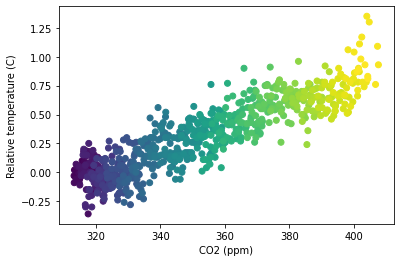

```python
import matplotlib.pyplot as plt
import pandas as pd

climate_change = pd.read_csv('climate_change.csv', parse_dates=['date'], index_col='date')
```

### Adding error-bars to a bar chart


```python
fig, ax = plt.subplots()

# Add data: "co2", "relative_temp" as x-y, index as color
ax.scatter(climate_change['co2'], climate_change['relative_temp'], c=climate_change.index)

# Set the x-axis label to "CO2 (ppm)"
ax.set_xlabel('CO2 (ppm)')

# Set the y-axis label to "Relative temperature (C)"
ax.set_ylabel('Relative temperature (C)')

plt.show()
```




