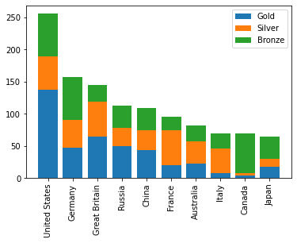

```python
import matplotlib.pyplot as plt
import pandas as pd

medals = pd.read_csv('medals_by_country_2016.csv', index_col=0)
```


```python
fig, ax = plt.subplots()

# Add bars for "Gold" with the label "Gold"
ax.bar(medals.index, medals['Gold'], label='Gold')

# Stack bars for "Silver" on top with label "Silver"
ax.bar(medals.index, medals['Silver'], bottom=medals['Gold'], label='Silver')

# Stack bars for "Bronze" on top of that with label "Bronze"
ax.bar(medals.index, medals['Bronze'], bottom=medals['Gold']+medals['Silver'], label='Bronze')

# Set the x-axis tick labels to the country names
ax.set_xticklabels(medals.index, rotation=90)

# Display the legend
ax.legend()

plt.show()
```




