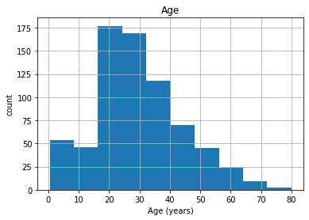

```python
import pandas as pd
import matplotlib.pyplot as plt

# Assign filename: file
file = 'titanic_sub.csv'

# Import file: data
data = pd.read_csv(file, sep=',', comment='#', na_values='Nothing')

# Print the head of the DataFrame
print(data.head())

# Plot 'Age' variable in a histogram
pd.DataFrame.hist(data[['Age']])
plt.xlabel('Age (years)')
plt.ylabel('count')
plt.show()

```

       PassengerId  Survived  Pclass     Sex   Age  SibSp  Parch  \
    0            1         0       3    male  22.0      1      0   
    1            2         1       1  female  38.0      1      0   
    2            3         1       3  female  26.0      0      0   
    3            4         1       1  female  35.0      1      0   
    4            5         0       3    male  35.0      0      0   
    
                 Ticket     Fare Cabin Embarked  
    0         A/5 21171   7.2500   NaN        S  
    1          PC 17599  71.2833   C85        C  
    2  STON/O2. 3101282   7.9250   NaN        S  
    3            113803  53.1000  C123        S  
    4            373450   8.0500   NaN        S  




