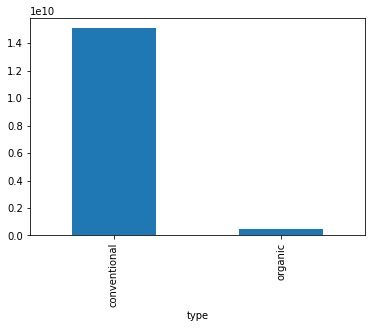
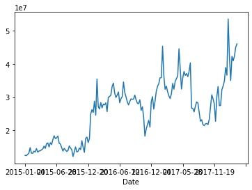
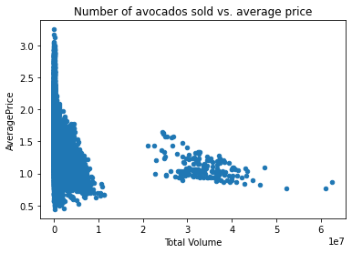
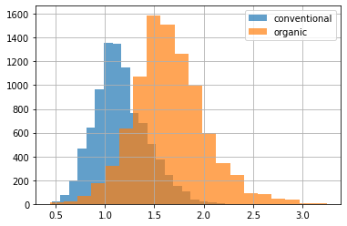

### Get data from csv


```python
import pandas as pd
avocados = pd.read_csv('avocado.csv',index_col=0)
```


```python
avocados.head()
```


<div>
<style scoped>
    .dataframe tbody tr th:only-of-type {
        vertical-align: middle;
    }

    .dataframe tbody tr th {
        vertical-align: top;
    }

    .dataframe thead th {
        text-align: right;
    }
</style>
<table border="1" class="dataframe">
  <thead>
    <tr style="text-align: right;">
      <th></th>
      <th>Date</th>
      <th>AveragePrice</th>
      <th>Total Volume</th>
      <th>4046</th>
      <th>4225</th>
      <th>4770</th>
      <th>Total Bags</th>
      <th>Small Bags</th>
      <th>Large Bags</th>
      <th>XLarge Bags</th>
      <th>type</th>
      <th>year</th>
      <th>region</th>
    </tr>
  </thead>
  <tbody>
    <tr>
      <th>0</th>
      <td>2015-12-27</td>
      <td>1.33</td>
      <td>64236.62</td>
      <td>1036.74</td>
      <td>54454.85</td>
      <td>48.16</td>
      <td>8696.87</td>
      <td>8603.62</td>
      <td>93.25</td>
      <td>0.0</td>
      <td>conventional</td>
      <td>2015</td>
      <td>Albany</td>
    </tr>
    <tr>
      <th>1</th>
      <td>2015-12-20</td>
      <td>1.35</td>
      <td>54876.98</td>
      <td>674.28</td>
      <td>44638.81</td>
      <td>58.33</td>
      <td>9505.56</td>
      <td>9408.07</td>
      <td>97.49</td>
      <td>0.0</td>
      <td>conventional</td>
      <td>2015</td>
      <td>Albany</td>
    </tr>
    <tr>
      <th>2</th>
      <td>2015-12-13</td>
      <td>0.93</td>
      <td>118220.22</td>
      <td>794.70</td>
      <td>109149.67</td>
      <td>130.50</td>
      <td>8145.35</td>
      <td>8042.21</td>
      <td>103.14</td>
      <td>0.0</td>
      <td>conventional</td>
      <td>2015</td>
      <td>Albany</td>
    </tr>
    <tr>
      <th>3</th>
      <td>2015-12-06</td>
      <td>1.08</td>
      <td>78992.15</td>
      <td>1132.00</td>
      <td>71976.41</td>
      <td>72.58</td>
      <td>5811.16</td>
      <td>5677.40</td>
      <td>133.76</td>
      <td>0.0</td>
      <td>conventional</td>
      <td>2015</td>
      <td>Albany</td>
    </tr>
    <tr>
      <th>4</th>
      <td>2015-11-29</td>
      <td>1.28</td>
      <td>51039.60</td>
      <td>941.48</td>
      <td>43838.39</td>
      <td>75.78</td>
      <td>6183.95</td>
      <td>5986.26</td>
      <td>197.69</td>
      <td>0.0</td>
      <td>conventional</td>
      <td>2015</td>
      <td>Albany</td>
    </tr>
  </tbody>
</table>
</div>


```python
avocados.columns
```


    Index(['Date', 'AveragePrice', 'Total Volume', '4046', '4225', '4770',
           'Total Bags', 'Small Bags', 'Large Bags', 'XLarge Bags', 'type', 'year',
           'region'],
          dtype='object')


### Plot data with bar


```python
import matplotlib.pyplot as plt
# Get the total number of avocados sold of each size
nb_sold_by_type = avocados.groupby('type')['Total Volume'].sum()

# Create a bar plot of the number of avocados sold by size
nb_sold_by_type.plot(kind='bar')
```


    <matplotlib.axes._subplots.AxesSubplot at 0x1163b2a58>





### Plot data with line


```python
# Get the total number of avocados sold on each date
nb_sold_by_date = avocados.groupby('Date')['Total Bags'].sum()

# Create a line plot of the number of avocados sold by date
nb_sold_by_date.plot(kind='line')

# Show the plot
plt.show()
```





### Plot with scatter


```python
# Scatter plot of nb_sold vs avg_price with title
avocados.plot(x='Total Volume', y='AveragePrice', kind='scatter', title='Number of avocados sold vs. average price')

# Show the plot
plt.show()
```





### Plot with histograms


```python
# Histogram of conventional avg_price 
avocados[avocados['type']=='conventional']['AveragePrice'].hist(alpha=0.7, bins=20)

# Histogram of organic avg_price
avocados[avocados['type']=='organic']['AveragePrice'].hist(alpha=0.7, bins=20)

# Add a legend
plt.legend(['conventional','organic'])

# Show the plot
plt.show()
```





```python

```
