# Decision-Tree or CART (Classification And Regression Tree)

### Decision tree

### Information gain

# k-Fold CV

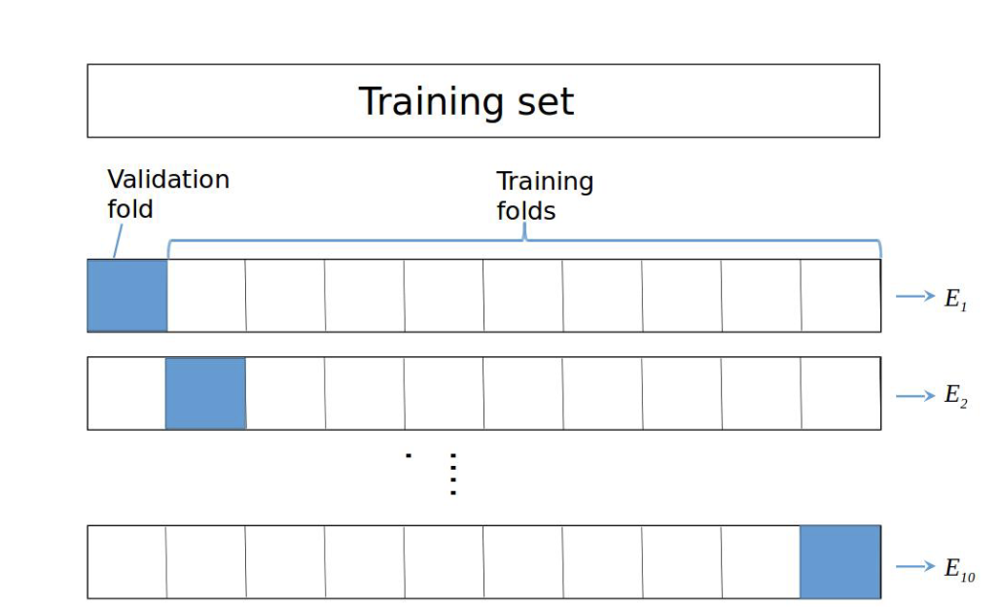

CV error = $\frac{E_1 + E_2 + \cdots + E_10}{10}$

# Ensemble learning

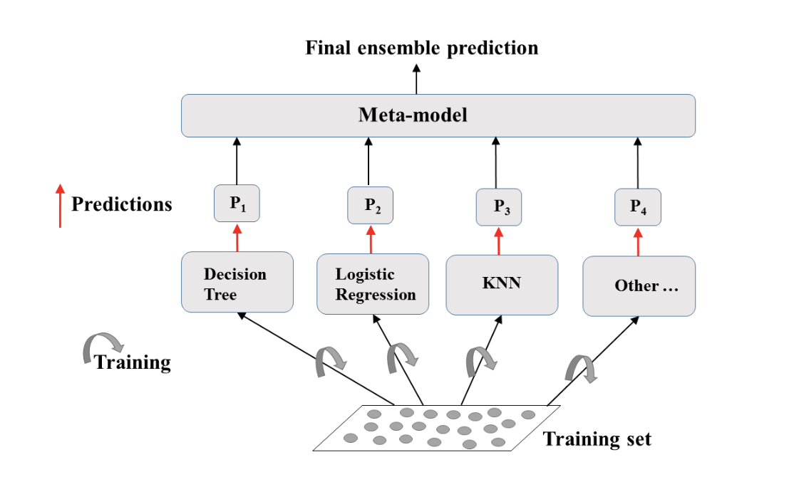

### Meta-model = hard voting

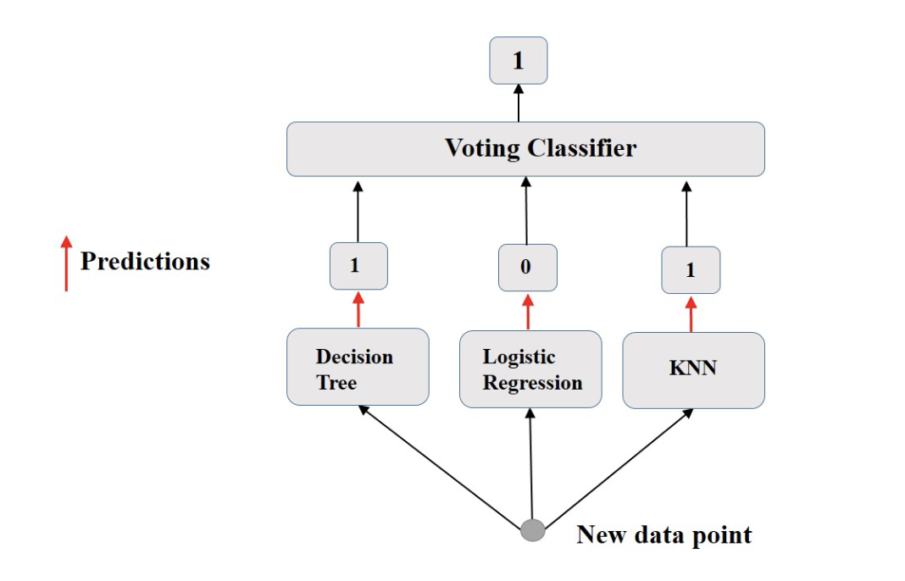

# Bagging

### Bootstrap

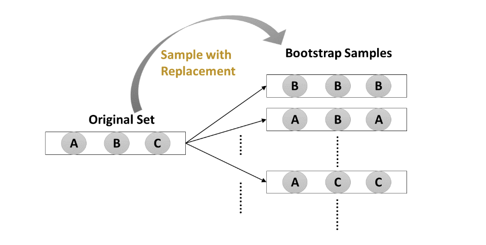

### Bagging training

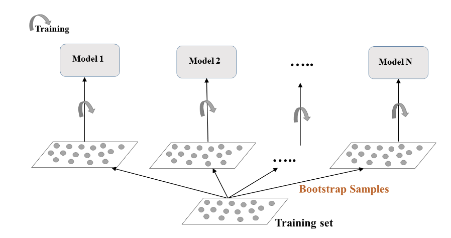

### Bagging prediction
- Classification: Aggregates predictions by majority voting
- Regression: Aggregates predictions through averaging.

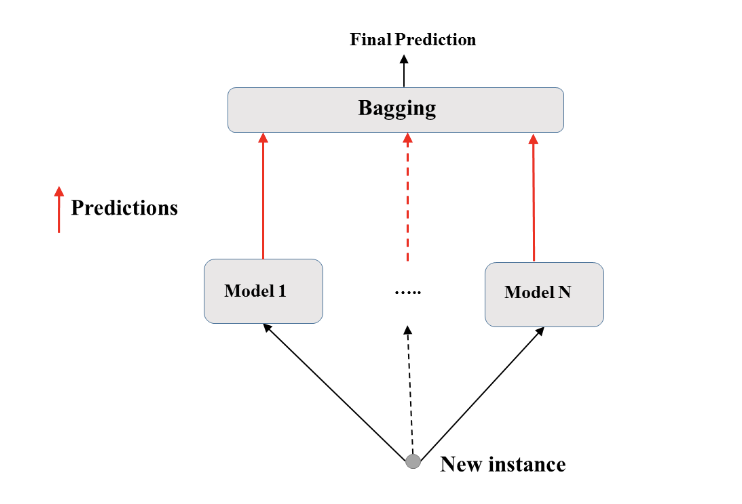

### Out of Bag evaluation

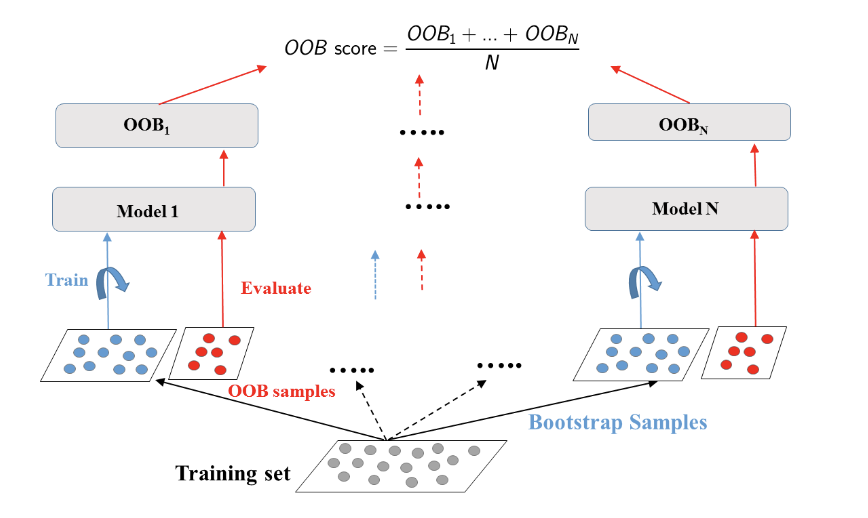

# Random Forests

### Training

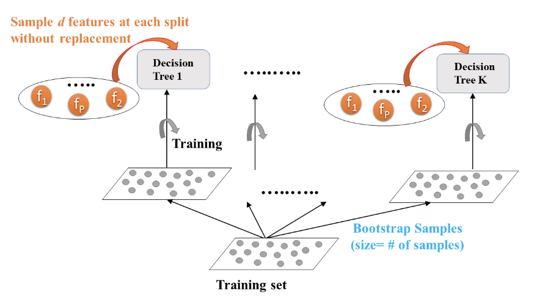

### Prediction

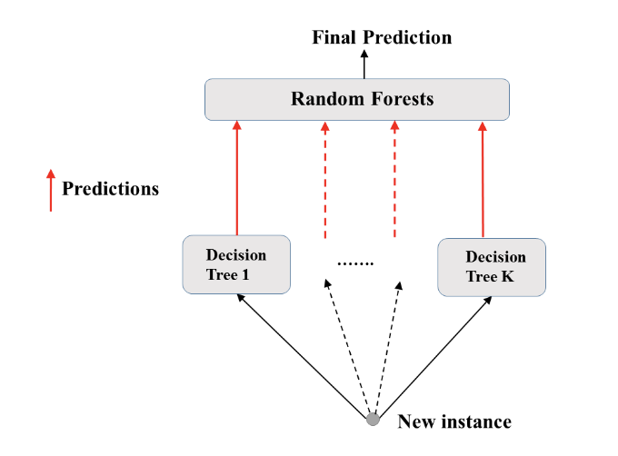

# Boosting

## AdaBoost

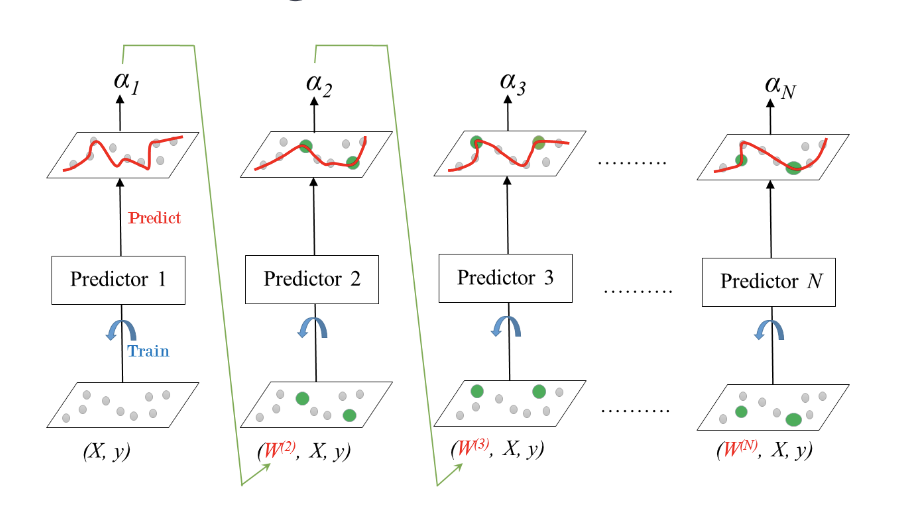

With learning rate $\alpha$:
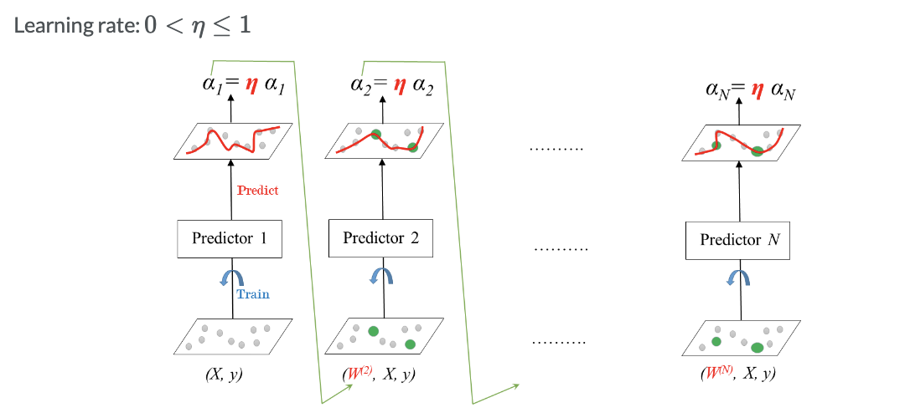

## Gradient Boost

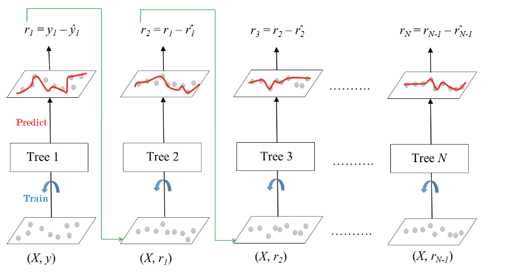

With shrinkage: $y_{pred} = y_1 + \eta*r_1 + \cdots + \eta*r_N$ 
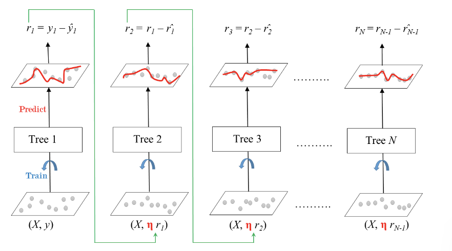

## Stochastic Gradient Boosting

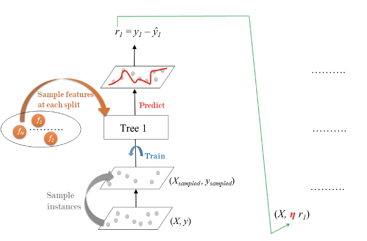
